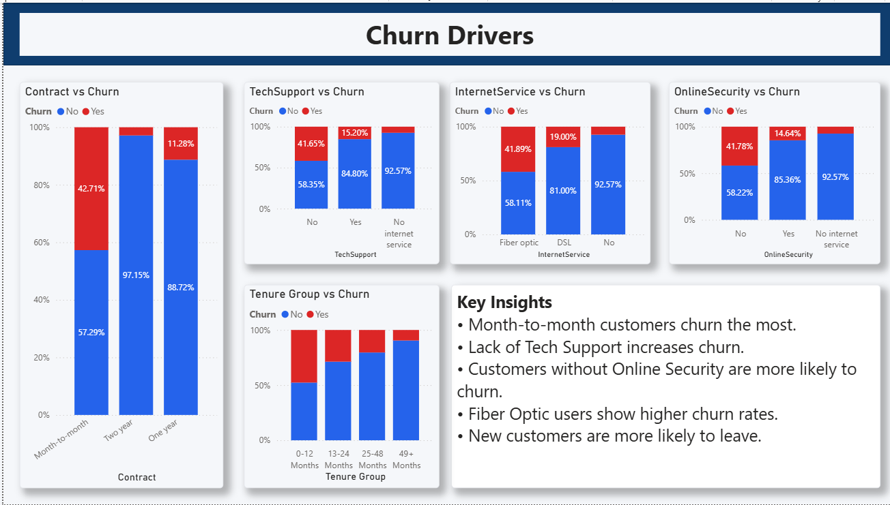

# 📊 Customer Churn Analysis & Prediction


---

# 📌 Project Overview

Customer churn is one of the most significant challenges faced by subscription-based businesses. Acquiring new customers is considerably more expensive than retaining existing ones. Therefore, understanding why customers leave is crucial for sustainable business growth.

This project performs a comprehensive Customer Churn Analysis using Python and Power BI to identify key factors contributing to customer attrition. Through exploratory data analysis and interactive dashboards, the project uncovers customer behavior patterns, service-related issues, and billing characteristics associated with churn.

The insights generated from this analysis can help organizations implement targeted retention strategies and improve customer satisfaction.

---

# 🎯 Project Objectives

* Analyze customer churn patterns.
* Identify the major factors influencing customer attrition.
* Understand customer demographics and behavior.
* Evaluate the impact of contracts, services, and billing methods on churn.
* Generate actionable business recommendations.
* Develop an interactive Power BI dashboard for decision-makers.

---

# 🛠️ Tools & Technologies Used

## Programming & Analysis

* Python
* Pandas
* NumPy

## Data Visualization

* Matplotlib
* Seaborn
* Power BI

## Development Environment

* Jupyter Notebook
* VS Code

---

# 📚 Dataset Information

The project uses the Telco Customer Churn Dataset containing customer demographic, service, contract, and billing information.

### Dataset Statistics

| Metric          | Value |
| --------------- | ----- |
| Total Records   | 7,032 |
| Features        | 21    |
| Target Variable | Churn |

### Key Features

* Gender
* Senior Citizen
* Partner
* Dependents
* Tenure
* Internet Service
* Online Security
* Tech Support
* Contract Type
* Paperless Billing
* Payment Method
* Monthly Charges
* Total Charges
* Churn Status

### Business Domain

Telecommunications Industry

---

# 📂 Project Structure

```text
Customer Churn Analysis and Prediction
│
├── data/
│   └── churn.csv
│
├── notebooks/
│   └── customer_churn_analysis.ipynb
│
├── dashboard/
│   └── Customer_Churn_Dashboard.pbix
│
├── images/
│   ├── executive_summary.png
│   ├── customer_demographics.png
│   ├── churn_drivers.png
│   └── revenue_billing_analysis.png
│
├── requirements.txt
│
└── README.md
```

---

# 📈 Project Workflow

## 1️⃣ Data Collection

* Imported customer churn dataset.
* Explored dataset structure.
* Examined feature descriptions.

## 2️⃣ Data Cleaning

* Checked missing values.
* Removed inconsistencies.
* Converted data types.
* Handled categorical variables.
* Verified data quality.

## 3️⃣ Exploratory Data Analysis (EDA)

Performed analysis on:

* Customer demographics
* Contract information
* Internet services
* Billing methods
* Revenue patterns
* Churn distribution

## 4️⃣ Dashboard Development

Created an interactive Power BI dashboard consisting of:

* Executive Summary
* Customer Demographics Analysis
* Churn Drivers Analysis
* Revenue & Billing Analysis

## 5️⃣ Business Insights & Recommendations

Generated actionable recommendations to reduce customer churn and improve customer retention.

---

# 📊 Dashboard Overview

The dashboard is divided into four analytical sections.

---

# 1️⃣ Executive Summary

Provides a high-level overview of customer churn.

### Key Performance Indicators

| Metric            | Value  |
| ----------------- | ------ |
| Total Customers   | 7,032  |
| Churned Customers | 1,869  |
| Churn Rate        | 26.58% |
| Retention Rate    | 73.42% |

### Key Insights

* Approximately one-fourth of customers have churned.
* Customer retention remains relatively strong at over 73%.
* Churn reduction initiatives should focus on high-risk customer segments.

---

# 2️⃣ Customer Demographics Analysis

Analyzes churn behavior across customer demographics.

### Key Findings

* Gender has minimal influence on churn.
* Senior citizens exhibit significantly higher churn rates.
* Customers without partners show increased churn.
* Customers without dependents are more likely to leave.

### Business Interpretation

Customer lifestyle and family status significantly influence retention behavior.

---

# 3️⃣ Churn Drivers Analysis

Identifies service-related factors contributing to customer attrition.

### Key Findings

* Month-to-month contracts have the highest churn rate.
* Customers without Tech Support churn more frequently.
* Customers without Online Security show elevated churn.
* Fiber Optic users experience higher churn rates.
* New customers are more likely to leave compared to long-term customers.

### Business Interpretation

Service quality and customer engagement are critical retention drivers.

---

# 4️⃣ Revenue & Billing Analysis

Evaluates the relationship between billing characteristics and customer churn.

### Key Findings

* Electronic Check users show the highest churn rate.
* Paperless Billing customers churn more frequently.
* Customers with high monthly charges are more likely to churn.
* Customers with lower total charges tend to leave more often.

### Business Interpretation

Billing experience and pricing strategies significantly impact customer retention.

---

# 📸 Dashboard Screenshots

## Executive Summary


---

## Customer Demographics Analysis


---

## Churn Drivers Analysis



---

## Revenue & Billing Analysis


---

# 🔑 Key Business Insights

## High-Risk Customer Segments

* Month-to-Month Contract Customers
* Senior Citizens
* Customers Without Partners
* Customers Without Dependents

## Service-Based Risk Factors

* Lack of Tech Support
* Lack of Online Security
* Fiber Optic Internet Service

## Revenue & Billing Risk Factors

* Electronic Check Payment Method
* Paperless Billing
* High Monthly Charges

## Customer Lifecycle Findings

* New customers exhibit the highest churn probability.
* Churn decreases significantly as customer tenure increases.
* Long-term customers demonstrate greater loyalty and retention.

---

# 💡 Business Recommendations

## Customer Retention Strategy

* Promote annual and two-year contracts through discounts.
* Implement loyalty rewards for long-term customers.
* Create onboarding programs for new customers.

## Service Improvement Strategy

* Bundle Tech Support with internet packages.
* Encourage adoption of Online Security services.
* Improve service quality for Fiber Optic customers.

## Revenue Optimization Strategy

* Encourage automatic payment methods.
* Re-evaluate pricing structures for high-charge customers.
* Introduce personalized offers for high-risk customers.

---

# 📊 Business Value Delivered

This project enables organizations to:

✅ Identify high-risk customers.

✅ Understand the primary causes of churn.

✅ Improve customer retention strategies.

✅ Reduce revenue loss due to customer attrition.

✅ Optimize service offerings.

✅ Support data-driven decision-making.

---

# 📈 Impact of the Project

The insights generated through this analysis can help businesses:

* Increase customer retention.
* Improve customer satisfaction.
* Enhance customer lifetime value.
* Reduce churn-related revenue loss.
* Improve strategic planning and decision-making.

---

# 🚀 Future Enhancements

* Customer Churn Prediction using Machine Learning
* Random Forest & XGBoost Modeling
* Customer Segmentation Analysis
* Customer Lifetime Value Prediction
* Automated Churn Risk Scoring
* Real-Time Power BI Dashboard
* Automated Reporting Pipeline

---

⭐ If you found this project useful, consider giving it a star and sharing your feedback!
